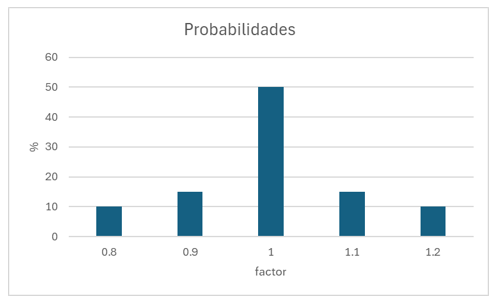

# montecarlo

## TRABAJO EN PROCESO
### Objetivo
A partir de un archivo con los datos de los nudos de carga del modelo, se obtienen valores aleatorios de caudal para cada nodo de acuerdo con una distribución de probabilidades.

### Requisitos
* Se debe aportar la o las curvas de probalididad de caudales unitarios de los nodos, de la forma:
```
c_prob = [(10,0.8),(15, 0.9),(50, 1),(15,1.1),(10,1.2)]
```


Los cuales deben ser agregados al archivo `generarCaudales.py`.  Consisten en pares ordenados de probabilidad, valor.  

####Hay que mejorar esto de forma que se lean también de un archivo de entrada

* Se debe preparar un archivo de texto plano llamado `entrada.inp` con la información de los nudos de carga, con los datos de id, elevación, demanda y patrón, de la siguiente forma:
```
id	      elevacion	    demanda	  patron
 B         	1210        	16.9     	1   ;
 C         	1190        	33.1     	1   ;
 D         	1195        	33.1     	1   ;
 E         	1205        	25.3    	1   ;
```
* Con el archivo `entrada.inp` se corre el programa `generarCaudales.py` que da un archivo de salida llamado `junctions.inp` que es un fragmento del archivo `inp` de entrada para Epanet:  La corrida se ejecuta:
```
python3 generarCaudales.py
```
* Se debe tener preparado el archivo del modelo en formato `inp` el cual debe ser editado para obtener 2 partes: `head.inp` con las primeras líneas de código hasta después de la instrucción `[JUNCTIONS]` y otra parte llamada `bottom.inp` con la parte baja del archivo `inp` habiendo eliminado la información desde el inicio hasta antes de la instrucción `[RESERVOIRS]`
* Se construye el archivo de entrada a Epanet con las 2 partes, `head.inp`, `junctions.inp` y `bottom.inp`, para generar un archivo llamado `armado###.inp` así:
```
cat head.inp junctions.inp bottom.inp > armado###.inp
```
* Ahora con el archivo que se llama `armado.inp` se corre el modelo de Epanet, y se obtiene un archivo con nombre `armado###.rpt`, en donde `###` lo irá generando el scrit de bash, que corre `n` veces.
```
epanet2 armado###.inp armado###.rpt
```
**Nota:**  el comando anterior es para usar enm epanet para Linux.  En Windows usar `runepanet.exe` en lugar de `epanet2`.


Con la lista de archivos llamados  `armado000.rpt`, `armado001.rpt`, `armado002.rpt`, ... `armado999.rpt`, se prepara un archivo en formato de CSV, que se llama `reporte.csv`, y también se obtiene un archivo `reporte.json`.  En este momento solo lee un archivo.  Hay que hacer una rutina que lo repita con todos los archivos del directorio.
```
python3 leerRPT.py
```

## Por hacer
*  Está pendiente la confección del script de bash, para el proceso repetitivo 1000 veces.
  
